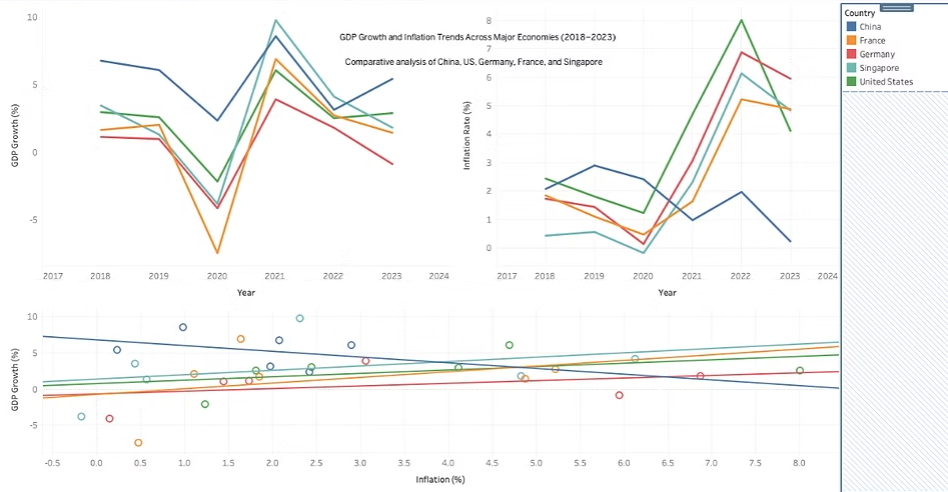
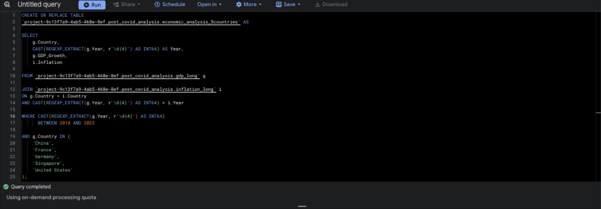

# Stability Over Speed: Reframing Post-COVID Recovery Beyond GDP Headlines

A SQL and Tableau case study examining how post-COVID GDP rebound changes in meaning when inflation is evaluated alongside it across five major economies.

## Project Overview

Post-COVID recovery is often discussed through headline GDP rebound. That framing is useful, but incomplete. A country can show visible growth recovery while also facing inflation pressure that changes how strong or sustainable that recovery really is.

This project was built to test whether post-COVID recovery still looked equally strong once inflation was evaluated alongside GDP growth. Using public World Bank data, I created a country-year comparison across China, France, Germany, Singapore, and the United States from 2018 to 2023. The workflow involved cleaning raw source files in BigQuery, reshaping both datasets into long format, merging them into a single analytical table, and visualizing the result in Tableau.

The central idea behind the project is simple: recovery speed and recovery quality are not necessarily the same.

## Analytical Question

How does post-COVID GDP rebound change in meaning when inflation is considered at the same time across selected major economies?

## Why This Matters

GDP rebound is one of the most visible ways to discuss recovery after a major disruption, but headline growth alone can overstate strength. A country may appear to recover quickly while also facing inflation pressure that makes that recovery less balanced than it first appears.

By evaluating GDP growth together with inflation, this project shows how a second pressure signal can change the interpretation of headline economic performance.

## Analytical Thinking

This project began with a simple concern: post-COVID recovery is often discussed through GDP rebound alone, but growth recovery does not always mean recovery quality. A country may show strong GDP recovery while also facing inflation pressure that changes how that rebound should be interpreted.

To address that, I analyzed GDP growth and inflation together rather than as separate headline indicators. The goal was not to rank countries by one metric, but to compare how recovery speed looked when viewed alongside price pressure. I selected five major economies with different post-COVID paths and restructured the data into a country-year model so both indicators could be compared consistently across the same time period.

A fuller reconstruction of the project logic is available in [`docs/analytical-thinking.md`](docs/analytical-thinking.md).

## Dataset

This project uses two public World Bank datasets:

- GDP growth
- Inflation

### Country Scope

- China
- France
- Germany
- Singapore
- United States

### Time Period

2018 to 2023

This window was chosen to capture three useful phases in a single comparison:

- pre-COVID baseline
- 2020 disruption
- post-COVID rebound

## Methodology Overview

The source files were not analysis-ready in raw form. The year values were arranged in wide format, which made direct comparison difficult across the same country-year structure.

To make the analysis usable, the workflow was organized into five stages:

1. Import raw GDP and inflation CSV files into BigQuery.
2. Filter both datasets to the selected countries and year range.
3. Create cleaned source tables for each indicator.
4. Reshape both datasets from wide format into long format.
5. Join GDP growth and inflation into one final country-year analytical table.

A fuller technical explanation is available in [`docs/methodology.md`](docs/methodology.md).

## SQL Workflow

The BigQuery pipeline used in this project is documented in the `sql/` folder:

- `01_create_gdp_clean.sql`
- `02_create_inflation_clean.sql`
- `03_create_gdp_long.sql`
- `04_create_inflation_long.sql`
- `05_create_economic_analysis_5countries.sql`
- `06_validate_final_table.sql`
- `07_missing_values_check.sql`
- `08_row_count_check.sql`

These files show how the raw World Bank data was transformed into an analysis-ready comparative model.

## Final Analytical Table

The final processed dataset used for visualization is:

`economic_analysis_5countries.csv`

It contains one row per country-year observation with the following fields:

- Country
- Year
- GDP_Growth
- Inflation

This dataset is included in:

`data/processed/economic_analysis_5countries.csv`

## Key Findings

- All five economies experienced a GDP shock in 2020, but rebound speed differed across countries.
- GDP recovery alone did not fully describe post-COVID strength once inflation was included in the picture.
- Several economies showed visible rebound after the 2020 contraction, but inflation pressure complicated how clean or balanced that recovery appeared.
- Comparing GDP growth and inflation together produced a more cautious interpretation than relying on headline GDP rebound alone.

## Limitations

This project is descriptive and comparative. It does not establish causal economic relationships.

Its scope is also intentionally narrow:

- only two indicators were used
- only five countries were selected
- the analysis covers 2018 to 2023 only
- inflation is treated as a pressure signal, not as a complete definition of stability

The value of the project is not that it provides a full macroeconomic model. The value is that it shows how a more careful analytical lens can change the interpretation of a headline metric.

## Visual Preview

### Tableau Dashboard

The Tableau dashboard brings the comparison together through GDP trend analysis, inflation trend analysis, and a combined GDP-growth-versus-inflation view.

### BigQuery Workflow

The BigQuery workflow documents the transformation layer behind the dashboard, showing how the raw public data was cleaned, reshaped, and merged into an analysis-ready country-year table.

